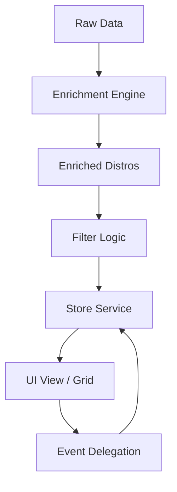

# 🐧 DistroSentinel

[](https://opensource.org/licenses/MIT)
[](https://www.typescriptlang.org/)
[](https://vitejs.dev/)
[](https://www.docker.com/)

**DistroSentinel** est une plateforme moderne et performante conçue pour explorer, filtrer et choisir la distribution Linux idéale. Développée avec une architecture de niveau **Staff+**, elle transforme un simple catalogue en un produit industriel scalable, sécurisé et ultra-rapide.


---

## ✨ Points Forts

- 🔍 **Recherche Intelligente** : Moteur de recherche fuzzy (sous-séquence) sur les noms, bases et points forts.
- 🏷️ **Filtrage Multidimensionnel** : Filtres par famille (Debian, Arch, RPM...), niveau (Débutant, Expert) et usages tags.
- 🌓 **Design Premium** : Interface réactive avec mode sombre natif, animations fluides et glassmorphisme.
- 📦 **Export de Données** : Exportez vos sélections ou le catalogue complet en JSON ou CSV en un clic.
- 🚀 **Prêt pour la Prod** : Conteneurisation Docker multi-stage optimisée avec Nginx.

---

## 🛠️ Stack Technique

- **Frontend** : Vanilla TypeScript, Vite, CSS3 (Custom Properties).
- **Architecture** : Pattern Observable Store pour une gestion d'état centralisée et réactive.
- **Data Domain** : Algorithmes d'enrichissement de données et de scoring de pertinence.
- **DevOps** : Dockerfile multi-stage, Nginx optimisé (Gzip, Cache-Control), compatible Coolify.

---

## 📐 Architecture du Projet



---

## 🚀 Installation & Déploiement

### Développement Local
```bash
# Installation des dépendances
npm install

# Lancement du serveur de dev
npm run dev
```

### Déploiement Docker
```bash
# Build de l'image
docker build -t distrosentinel .

# Lancement du container (Port 3000)
docker run -p 3000:3000 distrosentinel
```

---

## 🕵️ Audit Senior (Phase 10)

- **Performance** : Rendu optimisé via `DocumentFragment` et délégation d'événements.
- **Sécurité** : Sanitization XSS stricte sur toutes les injections de données.
- **Maintenabilité** : Typage TypeScript exhaustif et séparation stricte des domaines (Data/Logic/UI).

---

## 🤝 Contribution

Les contributions sont les bienvenues ! N'hésitez pas à ouvrir une issue ou à proposer une Pull Request pour enrichir le catalogue ou améliorer les performances de filtrage.

---

*Signé par l'équipe Staff+ du projet DistroSentinel.*
